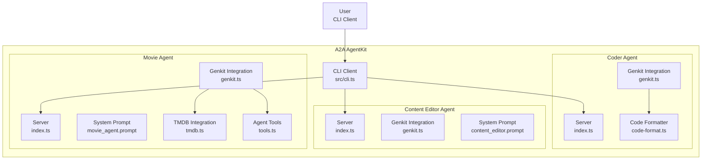

# A2A AgentKit

[](https://nodejs.org/)
[](https://www.typescriptlang.org/)
[](LICENSE)

Sample JavaScript/TypeScript agents demonstrating the Agent-to-Agent (A2A) protocol using Genkit and Google Gemini AI.

## Overview

The A2A AgentKit provides a collection of sample AI agents that implement the [Agent-to-Agent (A2A) protocol](https://a2a.dev). These agents showcase interoperable AI systems built with the A2A SDK, integrated with the [Genkit framework](https://genkit.dev/) and powered by Google Gemini AI models.

This kit serves as educational examples for developers interested in creating AI agents that can communicate, share tasks, and produce artifacts like code files or processed content.

### Architecture

The project consists of multiple specialized agents running as independent Express servers:

- **CLI Client** (`src/cli.ts`): Interactive terminal interface for testing agent interactions
- **Coder Agent** (`src/agents/coder/`): Generates complete code files from natural language prompts
- **Content Editor Agent** (`src/agents/content-editor/`): Proofreads and polishes text content
- **Movie Agent** (`src/agents/movie-agent/`): Retrieves movie information using TMDB API



## Features

- **A2A Protocol Compliance**: Full implementation of AgentCards, task handling, and event publishing
- **AI Integration**: Leverages Genkit with Gemini 1.5 Pro/Flash models for advanced AI capabilities
- **Specialized Agents**:
  - **Coder Agent**: Code generation with streaming artifact support for multi-file outputs
  - **Content Editor Agent**: Professional text proofreading and polishing
  - **Movie Agent**: Movie database queries with TMDB API integration
- **Streaming Responses**: Real-time updates for long-running tasks
- **Artifact Generation**: Automatic creation of code files, edited documents, and other outputs
- **Interactive CLI**: Terminal-based testing interface with status indicators
- **TypeScript First**: Full TypeScript support with strict typing and modern ES modules

## Getting Started

### Prerequisites

- **Node.js**: Version 18 or higher (ES modules support required)
- **npm**: Package manager (yarn also supported)
- **API Keys**:
  - [Google Gemini API Key](https://aistudio.google.com/) - Required for all agents
  - [TMDB API Key](https://developer.themoviedb.org/docs/getting-started) - Required only for Movie Agent

### Installation

1. **Clone the repository**:

   ```bash
   git clone https://github.com/ssdeanx/a2a-agentkit.git
   cd a2a-agentkit
   ```

2. **Install dependencies**:

   ```bash
   npm install
   ```

3. **Set environment variables**:

   ```bash
   # Required for all agents
   export GEMINI_API_KEY=your_gemini_api_key_here

   # Required for Movie Agent only
   export TMDB_API_KEY=your_tmdb_api_key_here
   ```

4. **Verify setup**:

   ```bash
   npm run a2a:cli
   ```

   This should display the CLI interface (agents not running yet).

## Run the Sample

### Start Individual Agents

Each agent runs as an independent server. Start them in separate terminals:

#### Movie Agent (Port 41241)

```bash
npm run agents:movie-agent
```

- AgentCard endpoint: `http://localhost:41241/.well-known/agent-card.json`

#### Coder Agent (Port 41242)

```bash
npm run agents:coder
```

- AgentCard endpoint: `http://localhost:41242/.well-known/agent-card.json`

#### Content Editor Agent (Port 10003)

```bash
npm run agents:content-editor
```

- AgentCard endpoint: `http://localhost:10003/.well-known/agent-card.json`

### Test Agent Interactions

1. **Start an agent** (choose one from above)
2. **Launch CLI in a new terminal**:

   ```bash
   npm run a2a:cli http://localhost:[PORT]
   ```

3. **Interact with the agent**:
   - Type natural language queries
   - Observe real-time status updates (⏳ working, ✅ completed)
   - Check for generated artifacts (code files, edited content)

### Example Interactions

#### Movie Agent

```bash
npm run a2a:cli http://localhost:41241

> Tell me about Inception
> What movies star Leonardo DiCaprio?
> Recommend sci-fi movies from 2023
```

#### Coder Agent

```bash
npm run a2a:cli http://localhost:41242

> Write a Python function to reverse a string
> Create a React component for a todo list
> Generate a Node.js Express server with GET /api/users
```

#### Content Editor Agent

```bash
npm run a2a:cli http://localhost:10003

> Fix this text: i luv coding but its hard
> Polish this article for professional publication
> Edit this email for better grammar and tone
```

### Development Mode

For development with hot reloading (no build step needed):

```bash
# Run agents directly with tsx
npx tsx src/agents/coder/index.ts
npx tsx src/agents/movie-agent/index.ts
npx tsx src/agents/content-editor/index.ts
```

## Testing Instructions

### Manual Testing

The project currently uses manual testing via the CLI interface. No automated tests are implemented yet.

**Testing Process:**

1. Start target agent in one terminal
2. Launch CLI client in another terminal
3. Test various queries and scenarios
4. Verify responses, artifacts, and error handling

**Test Coverage Areas:**

- ✅ Basic functionality for each agent
- ✅ Error handling with invalid inputs
- ✅ API key validation
- ✅ Artifact generation and file output
- ✅ Streaming response behavior
- ✅ Multi-turn conversations (Movie Agent)

### Future Testing Setup

Planned automated testing implementation:

- Unit tests for agent logic and utilities
- Integration tests for A2A protocol compliance
- E2E tests for CLI interactions
- Mock external APIs (TMDB, Gemini)
- Performance tests for streaming responses

## Documentation

- **[AGENTS.md](AGENTS.md)**: Comprehensive agent context for AI coding assistants
- **[documentation/](documentation/)**: Detailed guides and references
  - [Overview](documentation/overview.md): Project architecture and components
  - [Installation](documentation/installation.md): Setup and configuration
  - [Usage](documentation/usage.md): Running agents and CLI examples
  - [Agents](documentation/agents.md): Detailed agent specifications
  - [Architecture](documentation/architecture.md): Technical implementation details
  - [Security](documentation/security.md): Security considerations and best practices

## Security Considerations

> [!IMPORTANT]
> **Security Disclaimer**
>
> The sample code provided is for demonstration purposes and illustrates the mechanics of the Agent-to-Agent (A2A) protocol. When building production applications, it is critical to treat any agent operating outside of your direct control as a potentially untrusted entity.
>
> All data received from an external agent—including but not limited to its AgentCard, messages, artifacts, and task statuses—should be handled as untrusted input. For example, a malicious agent could provide an AgentCard containing crafted data in its fields (e.g., description, name, skills.description). If this data is used without sanitization to construct prompts for a Large Language Model (LLM), it could expose your application to prompt injection attacks.
>
> Failure to properly validate and sanitize this data before use can introduce security vulnerabilities into your application. Developers are responsible for implementing appropriate security measures, such as input validation and secure handling of credentials to protect their systems and users.

**Key Security Practices:**

- Always validate and sanitize external agent inputs
- Implement proper authentication and authorization
- Use environment variables for API keys
- Monitor and log security events
- Follow the principle of least privilege

## Contributing

This project welcomes contributions and suggestions. The codebase is designed as educational samples, not production-ready libraries.

### Development Guidelines

- Follow TypeScript best practices and strict typing
- Implement A2A protocol compliance in all agent interactions
- Test changes manually via CLI before submitting
- Update documentation for any workflow changes
- Consider security implications of all modifications

### Future Enhancements

- Automated test suite implementation
- Linting and formatting tools (ESLint, Prettier)
- Docker containerization for deployment
- Web-based UI for agent interactions
- Advanced security features for production use
- Multi-agent collaboration workflows
- Performance monitoring and optimization
- Additional sample agents demonstrating new capabilities

## Resources

- [A2A Protocol Documentation](https://a2a.dev) - Official protocol specification
- [Genkit Framework](https://genkit.dev/) - AI framework documentation
- [Google Gemini API](https://ai.google.dev/) - AI model documentation
- [TMDB API](https://developer.themoviedb.org/docs) - Movie database API
- [Express.js](https://expressjs.com/) - Web framework documentation
- [TypeScript Handbook](https://www.typescriptlang.org/docs/) - Language reference

## License

This project is licensed under the MIT License - see the [LICENSE](LICENSE) file for details.

---

*This is sample code for educational purposes. For production applications, additional security hardening and testing are required.*
