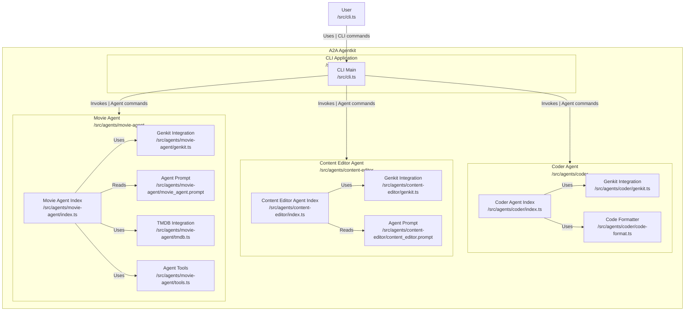

# JavaScript Samples

The provided samples are built using [Genkit](https://genkit.dev/) using the Gemini API.

## Agents

- [Movie Agent](src/agents/movie-agent/README.md): Uses TMDB API to search for movie information and answer questions.
- [Coder Agent](src/agents/coder/README.md): Generates full code files as artifacts.
- [Content Editor Agent](src/agents/content-editor/README.md)  
    Sample agent to proof-read and polish content. To make use of this agent in a content creation multi-agent system, check out the [content_creation](../python/hosts/content_creation/README.md) sample.

## Testing the Agents

First, follow the instructions in the agent's README file, then run `npx tsx ./cli.ts` to start up a command-line client to talk to the agents. Example:

1. Run npm install:

    ```bash
    npm install
    ```

2. Run an agent:

```bash
export GEMINI_API_KEY=<your_api_key>
npm run agents:coder

# in a separate terminal
npm run a2a:cli
```

## Note

This is sample code and not production-quality libraries.

## Disclaimer

Important: The sample code provided is for demonstration purposes and illustrates the
mechanics of the Agent-to-Agent (A2A) protocol. When building production applications,
it is critical to treat any agent operating outside of your direct control as a
potentially untrusted entity.

All data received from an external agent—including but not limited to its AgentCard,
messages, artifacts, and task statuses—should be handled as untrusted input. For
example, a malicious agent could provide an AgentCard containing crafted data in its
fields (e.g., description, name, skills.description). If this data is used without
sanitization to construct prompts for a Large Language Model (LLM), it could expose
your application to prompt injection attacks.  Failure to properly validate and
sanitize this data before use can introduce security vulnerabilities into your
application.

Developers are responsible for implementing appropriate security measures, such as
input validation and secure handling of credentials to protect their systems and users.

## Diagram



---

## Future Work

- Improve error handling and validation in agent commands
- Enhance logging and monitoring for better observability
- Optimize performance of agent interactions
- Expand test coverage for edge cases and failure scenarios
- Add more sample agents demonstrating different capabilities
- Integrate with additional external APIs and services
- Develop a web-based interface for interacting with agents
- Implement advanced security features for handling untrusted agents
- Explore multi-agent collaboration scenarios
- Refine prompts and agent behaviors for improved results

## Conclusion

This repository provides a foundational framework for building and experimenting with agent-based systems using Genkit and the Gemini API. The included sample agents demonstrate various capabilities and integrations, serving as a starting point for developers to create their own intelligent agents. As the field of AI continues to evolve, this codebase can be expanded and enhanced to explore new possibilities in agent interactions and functionalities.

## Documentation

For detailed guides, architecture, and security info, see the [documentation/ folder](documentation/).
